# 営業アシスタント — 朝のアポ情報自動収集と通知

`n8n-workflow.json` が定義するワークフローの処理の流れです。ワークフロー名は **「営業アシスタント - 朝のアポ情報自動収集と通知 (Step 1-2: トリガー・データ取得)」** です。

## 概要

毎朝スケジュール実行し、その日の **Google カレンダー** の予定を取得します。予定の説明文に **「会社名」** が含まれる案件だけを対象に、**会社名を AI で抽出** → **Web 検索で公式サイトを特定** → **サイト内の複数ページを取得して要約** → **Google スプレッドシートに1行追記** → **Slack と Gmail で営業担当向けの応援メッセージを通知** します。

## 前提（ワークフロー内で使う連携）

次の認証情報がノードに紐づいている想定です（実際の ID／アカウント名はインポート後に差し替えてください）。

| 用途 | ノード例 |
|------|-----------|
| Google カレンダー | `今日の予定を取得` |
| Google スプレッドシート | `Append row in sheet` |
| Gmail | `Send a message1` |
| Slack | `Send a message` |
| SerpApi（Google 検索） | `Google search` / `Google search1` |
| OpenAI API | `Message a model` ほか複数 |
| Google Gemini API | `予定の詳細から会社名を取得1` ほか |

タイムゾーンは **Asia/Tokyo**、カレンダー取得は **その日の 0:00〜23:59** を境界にしています。

## フロー全体（接続されているメイン経路）

```mermaid
flowchart LR
  A[実行スケジュールを設定] --> B[実行日を設定]
  B --> C[今日の予定を取得]
  C --> D[予定の詳細から会社名を取得 IF]
  D --> E[Message a model3 会社名抽出 GPT]
  E --> F[Google search]
  F --> G[HTTP Request トップページ取得]
  G --> H[Message a model ページ一覧 JSON]
  H --> I[Code in JavaScript 一覧を分割]
  I --> J[HTTP Request1 各URL取得]
  J --> K[Aggregate HTML結合]
  K --> L[Message a model4 会社情報 JSON]
  L --> M[Code in JavaScript1 行データ化]
  M --> N[Append row in sheet]
  N --> O[Message a model5 通知文生成]
  O --> P[Code in JavaScript4 JSON分割]
  P --> Q[Send a message Slack]
  P --> R[Send a message1 Gmail]
```

## ステップ別の説明

### 1. トリガーと実行日

1. **`実行スケジュールを設定`（Cron）**  
   毎日 **7:00** に実行（ワークフロー内設定）。

2. **`実行日を設定`（Set）**  
   実行時点の **日本時間でその日の開始・終了**（`start` / `end`）を ISO 形式で設定。カレンダー検索の `timeMin` / `timeMax` に使用。

### 2. カレンダー取得とフィルタ

3. **`今日の予定を取得`（Google Calendar）**  
   指定カレンダーから、`start`〜`end` のイベントを **すべて取得**（開始時刻順などオプションあり）。

4. **`予定の詳細から会社名を取得`（If）**  
   各イベントについて次を **両方**満たす場合のみ後続へ進みます（Sticky Note の説明と一致）。  
   - 説明文（`description`）が **空ではない**  
   - 説明文に **「会社名」という文字列が含まれる**  

   条件を満たさない予定はこの分岐では処理されません（IF の false 側はこの JSON では後続ノードに接続されていません）。

### 3. 会社名の特定と検索

5. **`Message a model3`（OpenAI）**  
   予定の **説明文から商談先の会社名を1つだけ** 抽出するプロンプト（見つからない場合は「不明」）。

6. **`Google search`（SerpApi）**  
   抽出した会社名をクエリに **Google 検索**（上位1件を利用する想定）。

7. **`HTTP Request`**  
   検索結果の **先頭オーガニック結果の URL** に GET し、企業サイトの **トップページ HTML** を取得。

### 4. サイト内ページの列挙と取得

8. **`Message a model`（OpenAI）**  
   トップページ HTML を解析し、**同一ドメイン内の主要ページ**について「画面名 → 絶対 URL」の **JSON オブジェクトだけ** を返すよう指示（`mailto:` 等は除外）。

9. **`Code in JavaScript`**  
   モデル出力の JSON をパースし、**各 `{ label, url }` をアイテムに分割**（複数ページを並列処理するため）。

10. **`HTTP Request1`**  
    各 URL に GET。**リダイレクトは追従しない** 設定。エラー時は `continueErrorOutput` で失敗分支も扱える構成。

11. **`Aggregate`**  
    取得した HTML などから **`data` フィールドを集約**（後段のモデルにまとめて渡すため）。

### 5. 会社情報の要約とスプレッドシート反映

12. **`Message a model4`（OpenAI）**  
    集約された HTML を入力に、**会社名・社員数・所在地・電話・事業内容・注目箇所（配列）** の固定キー JSON を出力。

13. **`Code in JavaScript1`**  
    上記 JSON を、スプレッドシートの列順に合わせて **1行分の配列 `values`** に整形（「注目箇所」は配列を箇条書きテキストに変換）。

14. **`Append row in sheet`（Google Sheets）**  
    スプレッドシート「今日のアポ予定」のシート **「アポ一覧」** に **行を追記**（列マッピングはノード内定義）。

### 6. 通知（Slack / Gmail）

15. **`Message a model5`（OpenAI）**  
    追記した行の会社情報を参照し、社内向けに **Slack 用テキスト** と **メール用 HTML** を **1つの JSON**（`slack_text`, `email_html`）で生成。構成は「今日のアポ先のポイント」「事前に押さえておきたい情報」「ひと言応援コメント」の3ブロック。

16. **`Code in JavaScript4`**  
    モデル出力から **`slack_text` と `email_html` をパース**して後続ノード用に渡す。

17. **`Send a message`（Slack）**  
    指定チャンネルに **`slack_text`** を投稿。

18. **`Send a message1`（Gmail）**  
    設定された宛先に **件名「本日のアポイントメント」** で **`email_html`** を送信。

---

## キャンバス上のメモ（Sticky Note）

| メモ | 内容の要約 |
|------|------------|
| Sticky Note | 実行日のイベントをカレンダーから取得。**イベントが0件**、または説明に「会社名」が書かれたイベントが **1件も無い** と処理対象にならない、という説明。 |
| Sticky Note2 | 会社サイトを取得し、**全画面の URL を取得**するブロックの説明。 |
| Sticky Note3 | **全画面の情報をまとめて分析・要約**するブロックの説明。 |
| Sticky Note4 | **要約を構造化してスプレッドシートに追加**するブロックの説明。 |
| Sticky Note5 | **通知メッセージを作成し、ツール別に通知**するブロックの説明。 |

## Gemini 版のノード（別系統・エクスポートでは未接続あり）

同じ業務を **Google Gemini** で実装したノード群（`予定の詳細から会社名を取得1`、`Google search1`、`Message a model1`、`Message a model2`、`Message a model6`、`Code in JavaScript2` / `Code in JavaScript3` など）が JSON に含まれていますが、**このファイルの `connections` だけを見ると、メイン経路とは線がつながっていない／途中で切れている部分**があります。エディタ上で分岐として使う予定だった可能性があります。利用する場合は n8n 上で **接続を確認・完成させる**か、不要なら削除してください。

また、`Code in JavaScript3` のコードは **`JSON.parse(...)` の閉じ括弧が欠けている**ように見えるため、そのままでは実行エラーになり得ます。インポート後にコードノードを開いて修正してください。

## 運用上のメモ

- ワークフローの **`active` はエクスポート時点で false** です。本番運用前にスケジュールと認証を確認し、必要なら有効化してください。
- `n8n-workflow.json` には **スプレッドシート ID・メールアドレス・チャンネル名** などが含まれる場合があります。公開リポジトリでは値をマスクするか、環境変数／認証情報で管理する運用を推奨します。
