# Sales assistant — morning appointment intel and notifications

This document describes the flow implemented in `n8n-workflow.json`. The workflow title in n8n is **「営業アシスタント - 朝のアポ情報自動収集と通知 (Step 1-2: トリガー・データ取得)」** (Japanese).

## Overview

Runs on a morning schedule, loads that day’s events from **Google Calendar**, and only continues for items whose description contains the literal text **「会社名」** (company name marker). It then **extracts the counterparty company name with AI**, **finds the corporate site via web search**, **fetches and summarizes multiple pages**, **appends one row to Google Sheets**, and sends an internal **cheer-up message via Slack and Gmail**.

## Integrations (credentials expected on nodes)

Replace credential IDs / account names after import as needed.

| Purpose | Example nodes |
|--------|------------------|
| Google Calendar | `今日の予定を取得` |
| Google Sheets | `Append row in sheet` |
| Gmail | `Send a message1` |
| Slack | `Send a message` |
| SerpApi (Google search) | `Google search` / `Google search1` |
| OpenAI API | Several `Message a model*` nodes |
| Google Gemini API | `予定の詳細から会社名を取得1` and others |

Timezone is **Asia/Tokyo**. Calendar window is **start/end of that local calendar day** (`start` / `end` ISO fields).

## End-to-end flow (connected main path)

```mermaid
flowchart LR
  A[Cron 実行スケジュールを設定] --> B[Set 実行日を設定]
  B --> C[Google Calendar 今日の予定を取得]
  C --> D[If 予定の詳細から会社名を取得]
  D --> E[OpenAI Message a model3 company name]
  E --> F[SerpApi Google search]
  F --> G[HTTP Request top page]
  G --> H[OpenAI Message a model page map JSON]
  H --> I[Code split pages]
  I --> J[HTTP Request1 fetch each URL]
  J --> K[Aggregate merge HTML]
  K --> L[OpenAI Message a model4 company JSON]
  L --> M[Code in JavaScript1 row values]
  M --> N[Sheets Append row in sheet]
  N --> O[OpenAI Message a model5 notifications]
  O --> P[Code in JavaScript4 parse JSON]
  P --> Q[Slack Send a message]
  P --> R[Gmail Send a message1]
```

## Step-by-step

### 1. Trigger and run date

1. **`実行スケジュールを設定` (Cron)** — fires every day at **07:00** (as configured in the workflow).

2. **`実行日を設定` (Set)** — sets **`start`** and **`end`** for **that day in Japan time** (ISO strings), used as `timeMin` / `timeMax` for Calendar.

### 2. Calendar fetch and filter

3. **`今日の予定を取得` (Google Calendar)** — loads **all** events between `start` and `end` for the chosen calendar (ordering options set on the node).

4. **`予定の詳細から会社名を取得` (If)** — for each item, continues only if **both** hold (matches the Sticky Note intent):  
   - Event **`description` is not empty**  
   - **`description` contains the substring 「会社名」**  

   Events that fail the check are not processed on this branch (the **false** output has **no downstream nodes** in this JSON export).

### 3. Resolve company name and search

5. **`Message a model3` (OpenAI)** — extracts **one** counterparty company name from the description (or “不明” if none).

6. **`Google search` (SerpApi)** — runs a **Google search** using that string (expects to use the top organic result downstream).

7. **`HTTP Request`** — **GET** the **first organic result URL** and download the site **homepage HTML**.

### 4. Map site pages and fetch them

8. **`Message a model` (OpenAI)** — analyzes homepage HTML and returns **only** a JSON object mapping **human-readable page labels → absolute URLs**, same domain only; excludes `mailto:`, `tel:`, etc.

9. **`Code in JavaScript`** — parses that JSON and **splits** it into **one item per `{ label, url }`** for parallel fetches.

10. **`HTTP Request1`** — **GET** each URL; **redirects are not followed**. Uses **`continueErrorOutput`** so failures can be handled on an error branch.

11. **`Aggregate`** — aggregates the **`data`** field so the next model receives **combined HTML**.

### 5. Summarize company info and write Sheets

12. **`Message a model4` (OpenAI)** — from the merged HTML, outputs a fixed-schema JSON: **company name, headcount, address, phone, business summary, highlights (array)**.

13. **`Code in JavaScript1`** — maps that JSON into a **single row array `values`** matching sheet column order (bullet-list text for the highlights array).

14. **`Append row in sheet` (Google Sheets)** — appends to the spreadsheet **「今日のアポ予定」**, sheet **「アポ一覧」** (mapping defined on the node).

### 6. Notifications (Slack / Gmail)

15. **`Message a model5` (OpenAI)** — builds **one JSON** with **`slack_text`** and **`email_html`** for internal sales staff, with three sections: **today’s meeting highlights**, **what to double-check beforehand**, and **a short cheer message**.

16. **`Code in JavaScript4`** — parses model output into **`slack_text`** and **`email_html`** for downstream nodes.

17. **`Send a message` (Slack)** — posts **`slack_text`** to the configured channel.

18. **`Send a message1` (Gmail)** — sends **`email_html`** with subject **「本日のアポイントメント」** to the configured recipient.

---

## Sticky notes on the canvas

| Note | Summary |
|------|---------|
| Sticky Note | Explains calendar fetch: if **no events**, or **no** event description contains 「会社名」, nothing useful runs for this path. |
| Sticky Note2 | Block for **fetching the corporate site and collecting page URLs**. |
| Sticky Note3 | Block for **merging all page content and analyzing / summarizing**. |
| Sticky Note4 | Block for **structuring the summary and appending to the spreadsheet**. |
| Sticky Note5 | Block for **drafting notification copy and sending via each tool**. |

## Gemini alternative nodes (partially unwired in export)

The JSON also contains **Google Gemini** variants (`予定の詳細から会社名を取得1`, `Google search1`, `Message a model1`, `Message a model2`, `Message a model6`, `Code in JavaScript2` / `Code in JavaScript3`, etc.). In **`connections` alone**, some of these are **not linked to the main path** or **stop mid-chain**. They may be experimental branches—**finish wiring in n8n** or **remove** if unused.

`Code in JavaScript3` appears to have a **missing closing parenthesis** on `JSON.parse(...)` and may throw at runtime until fixed in the Code node.

## Operations

- Workflow **`active` is `false`** in the exported file. Validate schedule and credentials before activating.
- `n8n-workflow.json` may embed **spreadsheet IDs, emails, channel names**, etc. For public repos, redact or move secrets to credentials / env vars.
